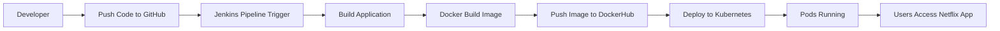
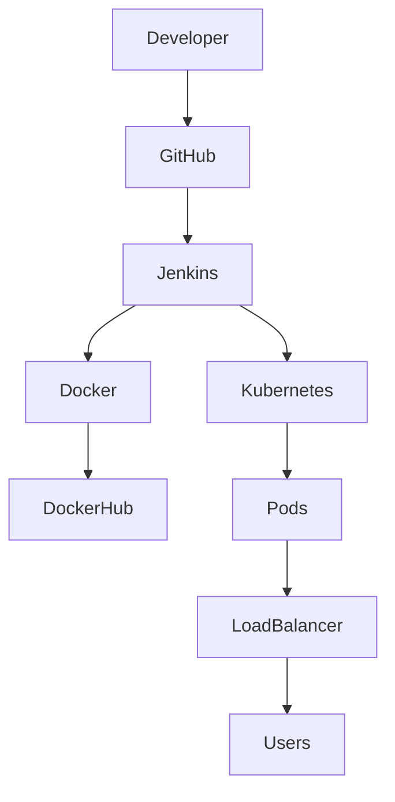

# Netflix Clone DevOps Project (CI/CD with Jenkins, Docker, Kubernetes)

## 📌 Project Overview

This project demonstrates the deployment of a **Netflix Clone application** using modern DevOps tools.

A complete **CI/CD pipeline** is implemented to automatically build, containerize, and deploy the application using **Jenkins, Docker, and Kubernetes**.

The application is deployed on **AWS EC2 infrastructure** and monitored using modern DevOps practices.

---

## 🛠 Tech Stack

* AWS EC2
* Linux (Amazon Linux / RHEL)
* Git & GitHub
* Jenkins
* Docker
* Kubernetes
* kubectl
* DockerHub
* NodeJS (Application)

---

## 🏗 DevOps Workflow Diagram



---

## 🏗 Architecture Diagram



---

# 🚀 Implementation Steps

## 1️⃣ Setup AWS Infrastructure

Create EC2 instances:

| Server            | Purpose                |
| ----------------- | ---------------------- |
| Jenkins Server    | CI/CD Pipeline         |
| Kubernetes Master | Cluster Control        |
| Worker Node       | Application Deployment |

---

## 2️⃣ Install Required Tools

Install Git

```
sudo dnf install git -y
```

Install Docker

```
sudo dnf install docker -y
sudo systemctl start docker
sudo systemctl enable docker
```

Install Jenkins

```
sudo dnf install java-17-amazon-corretto -y
sudo dnf install jenkins -y
sudo systemctl start jenkins
```

---

## 3️⃣ Clone Netflix Repository

```
git clone https://github.com/yourusername/netflix-devops-project.git
```

---

## 4️⃣ Build Docker Image

```
docker build -t netflix-clone .
```

---

## 5️⃣ Push Image to DockerHub

```
docker tag netflix-clone yourdockerhub/netflix-clone
docker push yourdockerhub/netflix-clone
```

---

## 6️⃣ Deploy Application to Kubernetes

Deployment

```
kubectl apply -f deployment.yaml
```

Service

```
kubectl apply -f service.yaml
```

---

## 🔎 Verify Deployment

Check Pods

```
kubectl get pods
```

Check Services

```
kubectl get svc
```

---

## 🌐 Access Application

Open in browser

```
http://NodeIP:NodePort
```

---

## 📊 Project Features

✔ CI/CD Pipeline with Jenkins
✔ Docker Containerization
✔ Kubernetes Deployment
✔ Scalable Architecture
✔ Automated DevOps Workflow

---

## 📸 Recommended Screenshots

Add these screenshots in README:

* Jenkins Pipeline Build
* Docker Image Build
* Kubernetes Pods
* Netflix Clone UI
* Jenkins Console Output

---

## 📚 Key Learning Outcomes

* Real-world DevOps pipeline implementation
* Docker containerization
* Kubernetes orchestration
* CI/CD automation with Jenkins
* AWS infrastructure management

---

## 👨‍💻 Author

**Uday Gurav**

DevOps | Cloud | Kubernetes | CI/CD | AWS
